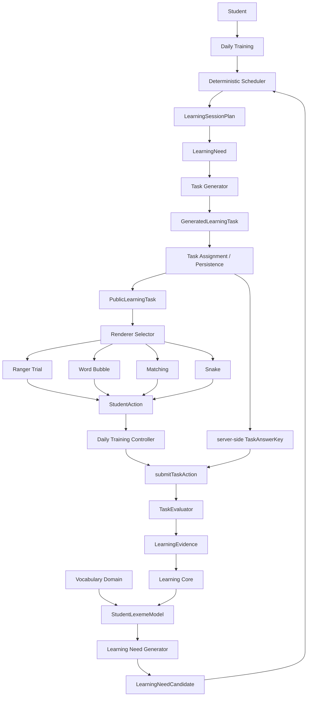

# WordRanger Architecture

WordRanger is a game-based vocabulary learning platform for junior-high students. Phase 09 adds **Daily Training** (`/train`, student-visible as 自由练习) as the product orchestration layer: one student-visible round, one `LearningSessionPlan`, lazy task generation, and a **direct** presentation after the public task exists. Ranger Trial, Word Bubble, Matching, and Snake remain interchangeable renderers and secondary free-play routes. There is still no student login.

## Formal layers



```text
Student
        ↓
Daily Training
        ↓
Scheduler / LearningSessionPlan
        ↓
TaskGenerator
        ↓
Renderer Selector
        ↓
PublicLearningTask + Renderer
        ↓
StudentAction
        ↓
submitTaskAction
        ↓
TaskEvaluator
        ↓
LearningEvidence
        ↓
Learning Core
        ↓
StudentLexemeModel
```

Responsibilities:

- **Vocabulary Domain** — what content exists, and which of it is production-approved
- **StudentLexemeModel** — current learner state for one lexeme
- **Learning Need Generator** — what learning needs exist for this student
- **Deterministic Scheduler** — which needs should happen now
- **LearningNeed** — stable contract passed downstream; not a task
- **Task Generator** — which task should represent the need
- **Task Assignment** — which user/session owns the generated task
- **Game Renderer** — how the public task is presented; emits only student action intent. Ranger Trial: CHOICE + TEXT_INPUT. Word Bubble: CHOICE single-tap. Matching: CHOICE via two ephemeral UI gestures. Snake: real-time ticks stay renderer-local; only option collision is a semantic event. Renderer-local interaction state is ephemeral and is not learning truth.
- **Game Session Controller** — generic `LearningGameSessionController` plans once, filters playable needs after scheduling, generates one assigned task at a time, calls `submitTaskAction`, returns a safe feedback DTO. Free-play routes still use this path.
- **Daily Training Controller** — product orchestration above any one `LearningGameDefinition`. One `LearningSessionPlan` per round, lazy one-task generation, Daily Training renderer policy (`DIRECT_PRACTICE` presentation), `submitTaskAction` with Evidence.gameId `RANGER_TRIAL` for new items. Not a fifth renderer.
- **Renderer Selector** — deterministic application policy for the generic game registry. Daily Training uses a separate direct-practice policy and does not ask this selector to pick Bubble / Matching / Snake. Not Scheduler policy and not Core.
- **Submission Service** (`submitTaskAction`) — loads the server-side answer key, verifies ownership, then grades
- **TaskEvaluator** — what the student action means
- **LearningEvidence** — the immutable fact
- **Learning Core** — how evidence changes the student model

Games never write mastery. Games never grade. Games never receive `TaskAnswerKey` on the production path. The scheduler never mutates learning state and never generates tasks.


## Vocabulary Domain

A PDF numbered entry is a `VocabularySourceEntry`. It is source fact, not a learning-state entity.

Example: source `#19 actor / actress` is one source entry and two trainable `Lexeme`s (`actor`, `actress`). Student state binds to `lexemeId`, never to a source entry.

`LexemeRelation` and `LexemeTags` form the word graph / enrichment layer. Relation `confidence` and `provenance` control production usability via `VocabularyContentPolicy`. `gameTags` describe data capabilities; they do not choose the next game.

Placement / curriculum metadata is also Vocabulary Domain reference data (`VocabularyPlacementMetadata`, bulk `listPlacementMetadata()`). It is keyed by `lexemeId`, carries per-field provenance, and is **not** learner state. `sourceIndex` is PDF numbered order, not difficulty. See `docs/VOCABULARY_PLACEMENT_METADATA.md`. Scheduler planning still reads only `listLexemes()` + `listRelations()`. Adaptive placement is **not** active: `assessAdaptivePlacementReadiness()` is `PLACEMENT_DATA_BLOCKER` until a `CURATED` / `EXTERNAL_REFERENCE` band overlay exists.

## Learning Core

The Learning Core is game-agnostic and does not import React, Supabase, or concrete games:

- Games emit `LearningEvidence`
- `processEvidence` is the orchestration entry
- Pure engine functions update `SkillState`, weaknesses, `MasteryStage`, `RetentionState`, scores, and review time
- `StudentLexemeModel` is the derived snapshot, keyed by `lexemeId`, and records `policyVersion`

Invariant: **games never write mastery state**. There is no `student.masteryStage = "RECALLED"` API.

`processEvidence` must not read lemma, Chinese meaning, synonym, or antonym to compute mastery. Those belong to Vocabulary Domain.

## Evidence

`LearningEvidence` is an immutable fact in an append-only event log. Outcomes are:

- `INDEPENDENT_CORRECT` — correct with no hint/scaffold (`hintCount` must be 0)
- `ASSISTED_CORRECT` — correct after hint/scaffold (`hintCount` must be > 0)
- `INCORRECT` / `SKIPPED` / `TIMEOUT`

`CORRECT` is not a valid outcome. Boundary validation rejects contradictory evidence.

If the scoring policy changes from v1 to v2, snapshots can be rebuilt from the original evidence. Each snapshot stores the `policyVersion` used to produce it.

## StudentLexemeModel

`StudentLexemeModel` is a projection:

- `MasteryStage` — how deeply the lexeme has been learned
- `RetentionState` — how stable the memory currently is
- `Weakness[]` — specific holes such as spelling or confusion (`relatedLexemeId`)
- per-skill `SkillState`
- review scheduling fields
- `policyVersion`

These three dimensions stay separate. A lexeme may be `MASTERED`, `FADING`, and have a `SPELLING` weakness at the same time. Word-graph fields do not belong on this snapshot.

## GameCapability

Games describe what they can train (`supportedSkills`, prompt/answer modes, weakness types, difficulty range). Capabilities do not list lexemes. Ranger Trial, Word Bubble, Matching, and Snake publish display capabilities only. Application orchestration may filter Scheduler needs against those skills after planning. That filter is not Scheduler policy.

## Scheduler

Need generation and scheduling are separate:

1. Generator emits `LearningNeedCandidate[]` from vocabulary + `StudentLexemeModel` + user marks
2. Vocabulary Domain → content capability facts → Scheduler feasibility filter (lexeme-aware)
3. Scoring produces an explainable `PriorityBreakdown`
4. Dedup merges `lexemeId + targetSkill`
5. Quotas classify by **all merged reasons**; diversity uses primary reason
6. `LearningSessionPlan`

The scheduler does not call Task Generator to test feasibility. Content capability is computed on the application side from bulk `VocabularyRepository` reads and passed in as facts.

```text
VocabularyRepository
  → listLexemes()
  → listRelations()
  → in-memory capability map
  → Scheduler
```

Session planning loads lexemes once and production-approved relations once, then builds the lexeme capability map locally. There is no per-lexeme `getRelations()` during planning.

The scheduler is read-only and policy-driven (`DEFAULT_SCHEDULER_POLICY`, currently v2). Scheduler output is still generated on demand; the generic game session persists a copy of the planned playable `LearningNeed`s as **game orchestration** so a cold start does not re-plan. That copy is not learning truth. See `docs/LEARNING_SCHEDULER.md`.

`LearningNeed.lexemeId` remains the protocol later game selection will match against `GameCapability`. Phase 04 does not select games.

## Dependency rule

Allowed:

- `games → domain/learning` types for `PublicLearningTask` / skills (display only)
- `task generator / debug UI / game session controller → domain/vocabulary` (via `VocabularyRepository`)

Forbidden:

- `domain/learning → games`
- `domain/learning → supabase`
- games querying Supabase vocabulary tables directly
- `domain/vocabulary` containing scheduler policy
- `domain/scheduler` importing Task Generator, TaskEvaluator, or `submitTaskAction`
- Game Renderers importing `TaskAnswerKey`, `LearningRepository`, or `submitTaskAction`

UI, API routes, and repositories contain no stage-transition rules. Those live in `src/domain/learning/engine`. Scheduler numeric behavior lives in `SchedulerPolicy`. See `docs/GAME_RENDERER_PROTOCOL.md` and `docs/CORE_V1_BASELINE.md`.

## Runtime today

```text
browser
  → Daily Training Server Action  (primary)
     or Ranger Trial / Word Bubble / Matching / Snake Server Action (free play)
  → DailyTrainingController or LearningGameSessionController
  → durable Game Session (`game_sessions.game_type`, revision CAS)
  → one authoritative session transition
  → durable LearningTask assignment (`learning_tasks`)
  → durable learner state (`student_lexeme_models` + `learning_evidence`)
  → submitTaskAction
  → TaskEvaluator
  → LearningEvidence
  → Learning Core
```

Daily Training is where WordRanger changes from a collection of games to a learning engine that uses interchangeable games. Student-facing `/train` is 自由练习: Scheduler still plans the words; the student only answers directly. “自由练习” is not free word selection. Free-play `/play/ranger-trial`, `/play/word-bubble`, `/play/matching`, and `/play/snake` remain reachable by URL and are not Homepage or `/train` entries. Both paths write the same `LearningEvidence` / `StudentLexemeModel`. Daily Training rows in `game_sessions` use `game_type = DAILY_TRAINING` as **orchestration identity only**. New `/train` items present as `DIRECT_PRACTICE` and write `Evidence.gameId = RANGER_TRIAL`. In-progress items that already stored Bubble / Matching / Snake keep that renderer until the item completes. `DIRECT_PRACTICE` is presentation identity, not a fifth Evidence gameId. Context Lab is not wired from Homepage.

Student-facing `/train` and the four free-play routes share `SupabaseLearningRepository`, `SupabaseLearningStateQueryRepository`, `SupabaseLearningTaskRepository`, bundled vocabulary, and `game_sessions`. Session writes are `INSERT` on create and revision CAS on update. There is no production in-memory Map for learning state, assigned tasks, or session orchestration.

Vocabulary on the student path is the bundled JSON dataset (`InMemoryVocabularyRepository` over git-versioned files). That is immutable reference data, not learner state.

Debug Labs and unit tests may still use in-memory repositories. Explicit `RANGER_TRIAL_RUNTIME=memory` (or the alias `GAME_RUNTIME=memory`) is a shared local/e2e fixture for Daily Training and all four student games. Production must leave both unset. Missing Supabase config in production fails closed. `npm run dev` follows `.env.local`; the code default is durable Supabase, and a stalled persistence call fails as `NETWORK_ERROR` instead of hanging.

There is no auth; student pages use `V1_PLACEHOLDER_USER_ID` (a UUID placeholder). Auth/RLS is future work. Server actions must not accept `userId` from the browser.

The home primary CTA is 开始自由练习 → `/train`. Scene learning stays 场景学习正在准备中. Free-play game routes remain reachable by URL but are not first-level home entries. See `docs/DAILY_TRAINING_EXPERIENCE.md`.

A separate Free Practice product (user-initiated, non-Scheduler word pool) is a Candidate only and is not implemented. It is not this `/train` path and not Ranger Trial Free Play. See `docs/FREE_PRACTICE_CONTRACT_CANDIDATE_V0.md`.

