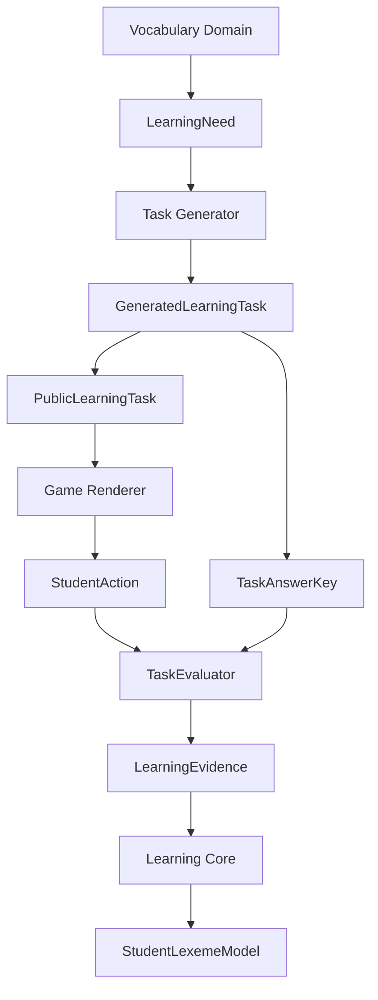

# WordRanger Architecture

WordRanger is a game-based vocabulary learning platform for junior-high students. Phase 03 adds the **Learning Task Protocol**. No production games, scheduler, or student login are included yet.

## Formal layers

Responsibilities:

- **Vocabulary Domain** — what a lexeme is, and which content is production-approved
- **LearningNeed** — what the student should practice now
- **Task Generator** — which task to emit
- **Game Renderer** — how the public task is presented
- **TaskEvaluator** — what the student action means
- **LearningEvidence** — the immutable fact
- **Learning Core** — how evidence changes the student model

Games never write mastery. Games never grade.

## Vocabulary Domain

A PDF numbered entry is a `VocabularySourceEntry`. It is source fact, not a learning-state entity.

Example: source `#19 actor / actress` is one source entry and two trainable `Lexeme`s (`actor`, `actress`). Student state binds to `lexemeId`, never to a source entry.

`LexemeRelation` and `LexemeTags` form the word graph / enrichment layer. Relation `confidence` and `provenance` control production usability via `VocabularyContentPolicy`. `gameTags` describe data capabilities; they do not choose the next game.

## Learning Core

The Learning Core is game-agnostic and does not import React, Supabase, or concrete games:

- Games emit `LearningEvidence`
- `processEvidence` is the orchestration entry
- Pure engine functions update `SkillState`, weaknesses, `MasteryStage`, `RetentionState`, scores, and review time
- `StudentLexemeModel` is the derived snapshot, keyed by `lexemeId`, and records `policyVersion`

Invariant: **games never write mastery state**. There is no `student.masteryStage = "RECALLED"` API.

`processEvidence` must not read lemma, Chinese meaning, synonym, or antonym to compute mastery. Those belong to Vocabulary Domain.

## Evidence

`LearningEvidence` is an immutable fact in an append-only event log. Outcomes are:

- `INDEPENDENT_CORRECT` — correct with no hint/scaffold (`hintCount` must be 0)
- `ASSISTED_CORRECT` — correct after hint/scaffold (`hintCount` must be > 0)
- `INCORRECT` / `SKIPPED` / `TIMEOUT`

`CORRECT` is not a valid outcome. Boundary validation rejects contradictory evidence.

If the scoring policy changes from v1 to v2, snapshots can be rebuilt from the original evidence. Each snapshot stores the `policyVersion` used to produce it.

## StudentLexemeModel

`StudentLexemeModel` is a projection:

- `MasteryStage` — how deeply the lexeme has been learned
- `RetentionState` — how stable the memory currently is
- `Weakness[]` — specific holes such as spelling or confusion (`relatedLexemeId`)
- per-skill `SkillState`
- review scheduling fields
- `policyVersion`

These three dimensions stay separate. A lexeme may be `MASTERED`, `FADING`, and have a `SPELLING` weakness at the same time. Word-graph fields do not belong on this snapshot.

## GameCapability

Games describe what they can train (`supportedSkills`, prompt/answer modes, weakness types, difficulty range). The engine does not hard-code `SnakeGame` or `MatchingGame`. Capabilities do not list lexemes.

## Future Scheduler

The Scheduler is not implemented in this phase. The intended loop is the diagram above. `LearningNeed.lexemeId` is the protocol the future Scheduler will match against `GameCapability`.

## Dependency rule

Allowed:

- `games → domain/learning` (emit evidence)
- `task generator / debug UI → domain/vocabulary` (via `VocabularyRepository`)

Forbidden:

- `domain/learning → games`
- `domain/learning → supabase`
- games querying Supabase vocabulary tables directly
- `domain/vocabulary` containing scheduler policy

UI, API routes, and repositories contain no stage-transition rules. Those live in `src/domain/learning/engine`.

## Runtime today

Debug Labs run against in-memory repositories loaded from `data/vocabulary/**`. `npm test` and `npm run dev` work without Supabase credentials. `SupabaseLearningRepository` and `SupabaseVocabularyRepository` are persistence adapters only.
