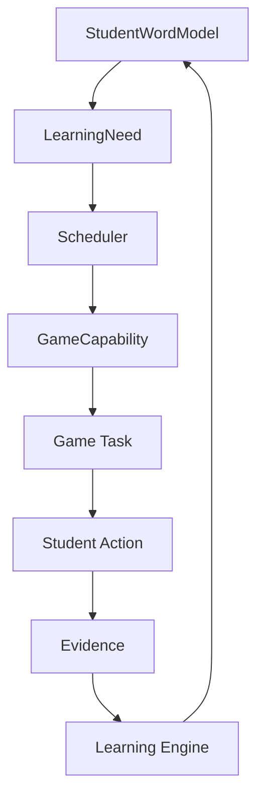

# WordRanger Architecture

WordRanger is a game-based vocabulary learning platform for junior-high students. This phase ships only the shared **Learning Core**. No production games, word import, or student login are included yet.

## Vocabulary Domain

The vocabulary domain owns lemmas, display forms, and (later) a word graph of synonyms, antonyms, families, and categories. V1 only stores a minimal `Word` record. Games may *use* words. They do not own mastery.

## Learning Core

The Learning Core is the only place that interprets practice. It is game-agnostic:

- Games emit `LearningEvidence`
- `processEvidence` is the orchestration entry
- Pure engine functions update `SkillState`, weaknesses, `MasteryStage`, `RetentionState`, scores, and review time
- `StudentWordModel` is the derived snapshot

Invariant: **games never write mastery state**. There is no `student.masteryStage = "RECALLED"` API.

## Evidence

`LearningEvidence` is an immutable fact in an append-only event log. An existing row cannot be rewritten into a different outcome. If the scoring policy changes from v1 to v2, snapshots can be rebuilt from the original evidence.

## StudentWordModel

`StudentWordModel` is a projection:

- `MasteryStage` — how deeply the word has been learned
- `RetentionState` — how stable the memory currently is
- `Weakness[]` — specific holes such as spelling or confusion
- per-skill `SkillState`
- review scheduling fields

These three dimensions stay separate. A word may be `MASTERED`, `FADING`, and have a `SPELLING` weakness at the same time.

## GameCapability

Games describe what they can train (`supportedSkills`, prompt/answer modes, weakness types, difficulty range). The engine does not hard-code `SnakeGame` or `MatchingGame`.

## Future Scheduler

The Scheduler is not implemented in this phase. The intended loop is:

`LearningNeed` is the protocol the future Scheduler will match against `GameCapability`. V1 only defines the types plus demo fixtures.

## Dependency rule

Allowed: `games → domain/learning`  
Forbidden: `domain/learning → games`

UI, API routes, and repositories contain no stage-transition rules. Those live in `src/domain/learning/engine`.

## Runtime today

The Debug Lab runs entirely against `InMemoryLearningRepository`, so `npm run dev` works without Supabase credentials. `SupabaseLearningRepository` is a persistence adapter only.
